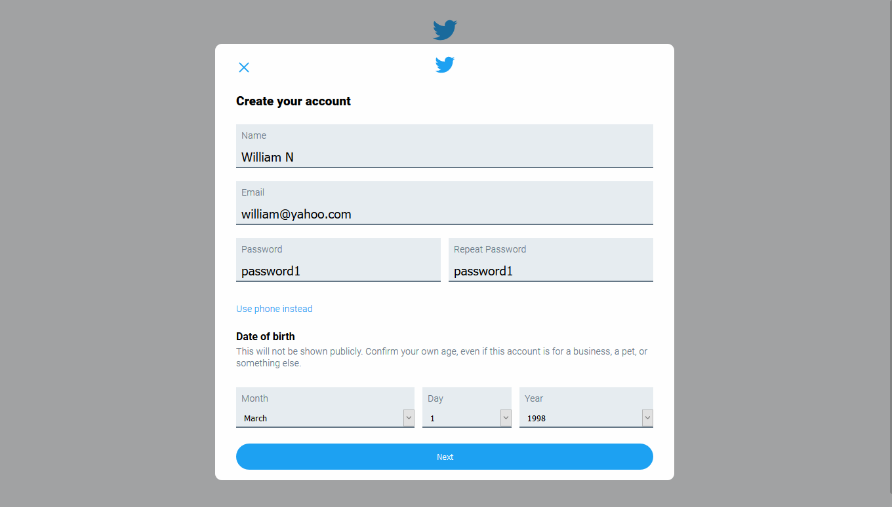
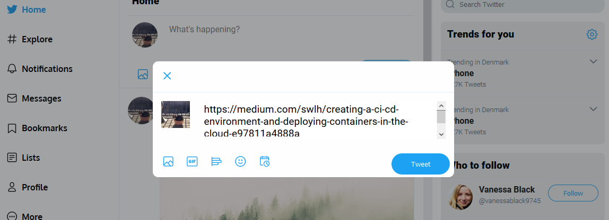
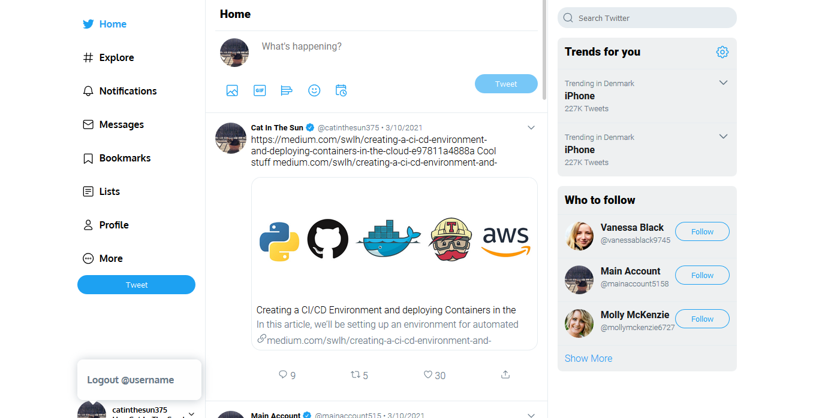
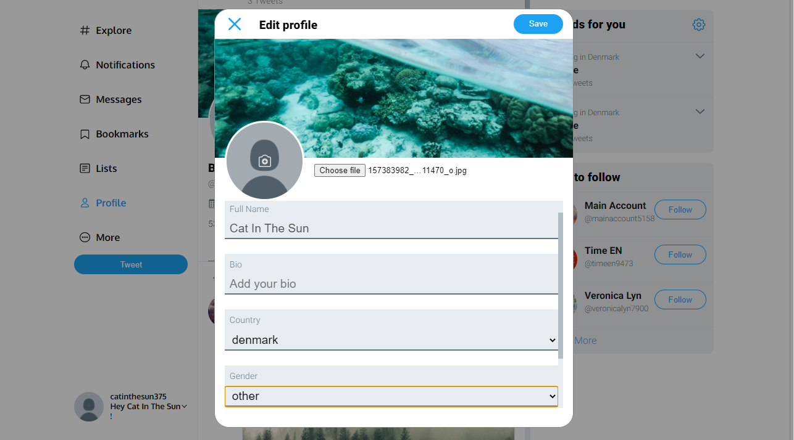
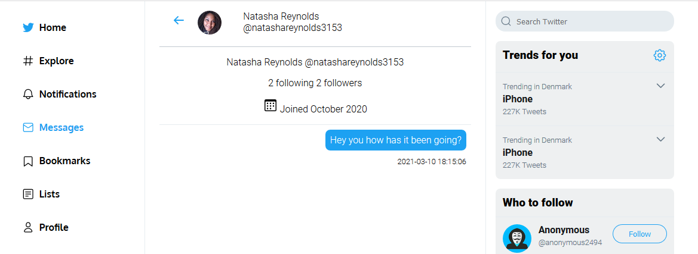
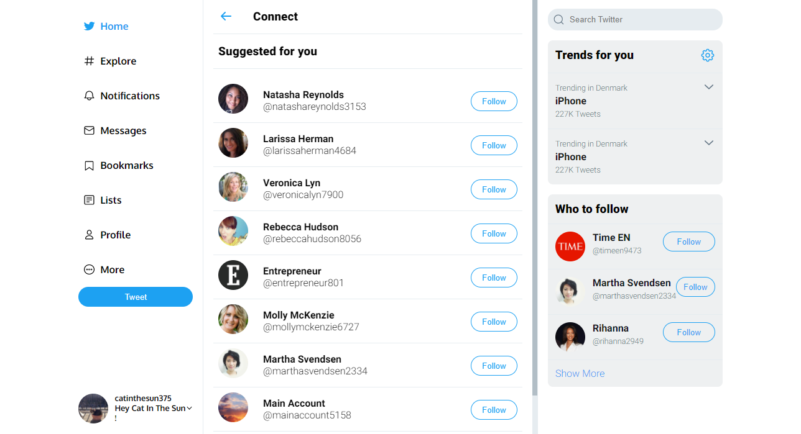

## Twitter Replica
A project that combines the power of PHP with different sorts of databases in order to replicate what the user experiences while engaging with the well known social media giant.

### Technologies
- PHP
- MariaDB
- PHPMailer
- ArangoDB

### Features
- Authentication System
- Password Reset System
- Dashboard
- Tweeting ( CRUD on tweets )
- Messaging ( with search query )
- Who To Follow Recommendation System
- Edit Profile ( image upload and user data change )

### Presentation of the features
- Signup View

- Tweet View

- Dashboard and Link Generation View

- Edit Profile View

- Edited Profile View

- Messaging View

- Graph-based Recommendations View
